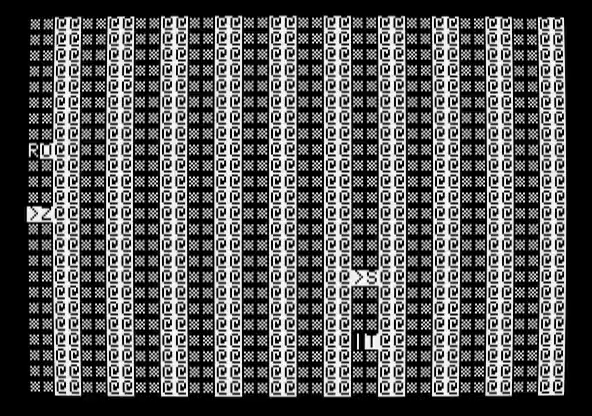
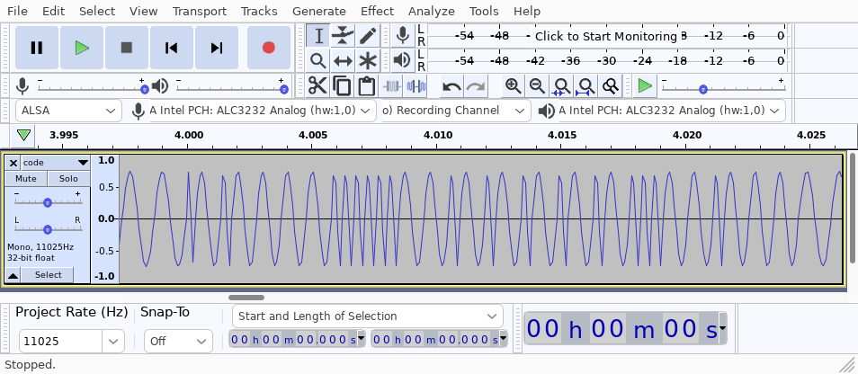

The Apple II has built-in support for reading/writing data to cassette tapes.
We can use this same mechanism to transfer data from a modern computer to the
Apple II.

This tool converts Applesoft BASIC source code into a .wav audio file. The
sound waves encode bits of data: a short pulse is a 0, and a long pulse is a 1.

